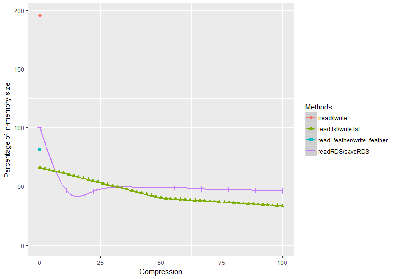
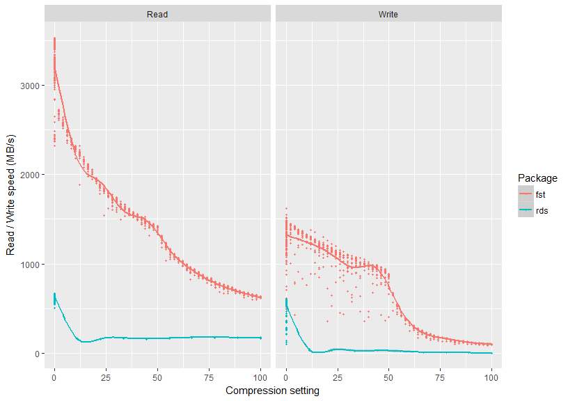

<!-- README.md is generated from README.Rmd. Please edit that file -->


[](https://travis-ci.org/fstpackage/fst) [](https://cran.r-project.org/package=fst)

Overview
--------

Package fst provides a fast, easy and flexible way to serialize data frames. It allows for fast compression and decompression and has the ability to access stored frames randomly. With access speeds of above 1 GB/s, fst is specifically designed to unlock the potential of high speed solid state disks that can be found in most modern computers. The figure below compares the read and write performance of the fst package to various alternatives.


Package fst outperforms the `feather` and `data.table` packages as well as the base `readRDS` / `writeRDS` functions for uncompressed reads and writes. But it also offers additional features such as very fast compression and random access (columns and rows) to the stored data.

Installation
------------

The easiest way to install the package is from CRAN:

``` r
install.packages("fst")
```

You can also use the development version from GitHub:

``` r
# install.packages("devtools")
devtools::install_github("fstPackage/fst")
```

Basic usage
-----------

Using fst is extremely simple. Data can be stored and retrieved using methods `fst.write` and `fst.read`:

``` r
# Generate a random data frame with 10 million rows and various column types
nrOfRows <- 1e7

x <- data.frame(
  Integers = 1:nrOfRows,  # integer
  Logicals = sample(c(TRUE, FALSE, NA), nrOfRows, replace = TRUE),  # logical
  Factors = factor(sample(state.name, nrOfRows, replace = TRUE)),  # text
  Numericals = runif(nrOfRows, 0.0, 100),  # numericals
  stringsAsFactors = FALSE)

# Store it
  write.fst(x, "dataset.fst")
  
# Retrieve it
  y <- read.fst("dataset.fst")
```

Random access
-------------

With `read.fst` you can access a selection of rows from the stored data frame by specifying a range:

``` r
  read.fst("dataset.fst", from = 2000, to = 4990)  # subset rows
```

You will notice that the read times for this small subset are very short because `read.fst` (almost) only touches the on-disk data from within the selected range. Specific columns can be selected with:

``` r
  read.fst("dataset.fst", c("Logicals", "Factors"), 2000, 4990) # subset rows and columns
```

Here, only data from the selected rows and columns are deserialized from file.

Compression
-----------

For compression the excellent and speedy [LZ4](https://github.com/lz4/lz4) and [ZSTD](https://github.com/facebook/zstd) compression algorithms are used. These compressors in combination with type-specific bit and byte filters, enable fst to achieve high compression speeds at reasonable compression factors. The compression factor can be tuned from 0 (minimum) to 100 (maximum):

``` r
  write.fst(x, "dataset.fst", 100)  # use maximum compression
```

For this particular data frame the on-disk size of `x` is less than 35 percent of the in-memory size (`object.size(x)`) when full compression is used. The figure below shows the compression ratio depending on the settings used and compares them to the ratio's achieved by the `feather` and `data.table` packages (without compression) and method `saveRDS` (gzip mode) from base R:



Note that the on-disk size of a csv file is usually larger than the in-memory size (here with a factor of about 2). There are only 10 settings for compression in base R gzip, which have been scaled up from 0 to 100 (setting 9) in the figure for easier comparison. The corresponding read and write speeds:



The read and write speeds reported in the figure are calculated by dividing the in-memory size of the data frame by the measured elapsed time for a read or write operation (more details will follow). As you can see, fst achieves very high read and write speeds, even for compressed data. For this benchmark, a modest laptop was used with a Core i7-4710HQ CPU @ 2.5GHz (but using a high-end PCI-e 3.0 x4 SSD to cope with the large IO speeds).

> **Note to users**: The binary format used for data storage by the package (the 'fst file format') is expected to evolve in the coming months. Therefore, **fst should not be used for long-term data storage**.
